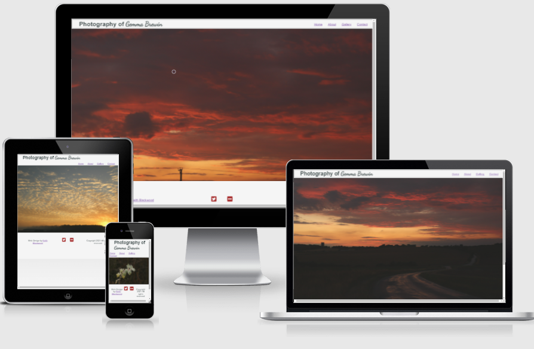
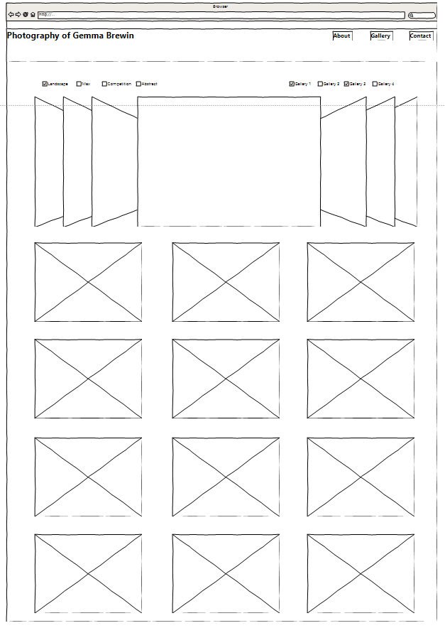

# **Photo website**

## **Site overview:**

Photo gallery websites are a common way for an artist to display their portfolio.

This website displays a number of images that were taken by Gemma Brewin

## **Planning stage:**

### **Target audience:**

People interested in viewing photos taken by the artist.

### ***User Stories:***

The user is to be able to:

* from the launch page, get an impression on the type of photos the artist takes
* navigate to the gallery to look at the photos.
* Contact the artist if they want more information.
* Link to the artists social media pages.

## **How it will be Achieved:** ##

* A navigation bar in the header will allow the user to reach all parts of the website
* The launch page will show the types of photos taken by the artist via a slide show of pictures randomly selected from the gallery.
* The gallery page will have all the images displayed in thumbnail views with filters depending on the pictures orientation and year it was taken.
* The footer will contain a connection to the artists twitter and flickr accounts. 

### **Wireframes:** ###

An inital wireframe was developed of the core gallery page

Along the design process the inital concept of a carosel was removed as it detracted from the image gallery.

### **Colour scheme:** ###

As the photos are varied in colour and contrast, and take up a large proportion of the screens real estate, a neutral colourscheme was selected to not clash with any specific photo.

A soft grey fade was used as the backdrop, with simple greys used to allow the images to maintain the focus of the 

### **Fonts:** ###

A dsylexic friendly font was used for the main text, with the exception of dancing script, which was used for the signature, a real signature was considered, but due to fraud concerns it was decided to use a font.

## **Site Features:** ##

Launch page.

A simple index page designed for people to land on, with limited text, a simple header and a slideshow showcasing a few of the images,

Navigation bar.

A feature of all the pages, the navigation bar has links to the other pages of the site.

Slideshow

The principal component of the 

A gallery page.

The main component of the website, this is a page that displays the images of the artist. Images can be filtered. 

An About Page.

This simple page details a small amount of information about the author

User story: The purpose of this website is to provide the user with access to photographs taken by Gemma Brewin.

Website key features:

The Websites key features are the filter galley and carousel that displays images. 

Deployment

