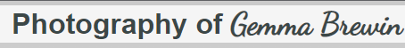
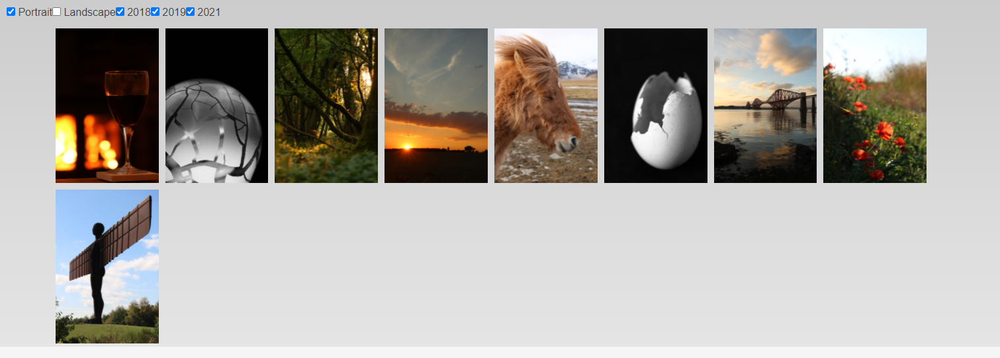

# **Photo website**

## **Site overview:**

Photo gallery websites are a common way for an artist to display their portfolio.

This website displays a number of images that were taken by Gemma Brewin

## **Planning stage:**

### **Target audience:**

People interested in viewing photos taken by the artist.

### ***User Stories:***

The user is to be able to:

* from the launch page, get an impression on the type of photos the artist takes
* navigate to the gallery to look at the photos.
* Contact the artist if they want more information.
* Link to the artists social media pages.

## **How it will be Achieved:** ##

* A navigation bar in the header will allow the user to reach all parts of the website
* The launch page will show the types of photos taken by the artist via a slide show of pictures randomly selected from the gallery.
* The gallery page will have all the images displayed in thumbnail views with filters depending on the pictures orientation and year it was taken.
* The footer will contain a connection to the artists twitter and flickr accounts. 

### **Wireframes:** ###

An inital wireframe was developed of the core gallery page

Along the design process the inital concept of a carosel was removed as it detracted from the image gallery.

### **Colour scheme:** ###

As the photos are varied in colour and contrast, and take up a large proportion of the screens real estate, a neutral colourscheme was selected to not clash with any specific photo.

A soft grey fade was used as the backdrop, with simple greys used to allow the images to maintain the focus of the 

### **Fonts:** ###

A dsylexic friendly font was used for the main text, with the exception of dancing script, which was used for the signature, a real signature was considered, but due to fraud concerns it was decided to use a font.

## **Site Features:** ##

### **Launch page:** ###

The launch page is a simple page with a header, footer, and slideshow.

### **Header:** ###

The header contains a logo, which is a stylised signature of the artist using googlefonts Dancing Script. 

A feature of all the pages, the navigation bar has links to the other pages of the site.

Nav links in the header go to the other pages of the site.

### **Slideshow:** ##

examples of images in the slide show

The principal component of the index page is the slideshow, this is a Javascript function that works in 2 steps.
* Selects 5 images from the gallerys which are in portrait
* Adds these images to the index page with a timer that changes the image every 5 seconds

### **Footer:** ##

The footer contains the artists social media links, twitter and flickr, additionally a copyright and web design.

## **Gallery page:** ##

The main component of the website, this is a page that displays the images of the artist. Images can be filtered by the tags at the top of the website.

This page is responsive and will switch to a single image width on small screens.

All selectors start ticked, when deselected the code does the following process

*Reveals all images
*Checks selector (ie, portrait is checked)
*Hides images if the box is not selected
*Moves to the next selectors
*Loops back to the hide image code
*Repeats through all selector boxes

## **About page:** ##

This simple page details a small amount of information about the author

## *Contacts page:** ##

A page that links the Linton Camera Club website, and the artists flickr and twitter accounts.

## **Deployment:** ##

Website is deployed on github pages:

https://raxxius.github.io/PhotoWebsite/index.html

### **Performance:** ###

The index.html page performance

The gallery.html page performance

While the performance of the website is somewhat slow, it should be noted that the website is deliberately image intensive as a function of the user story. The gallery page loads a lot of images, but the images are reduced in quality, however as the index page loads full size images, image quality was not comprimised. The design decision to limit the index slideshow to 5 images was a performace to function choice.  

No issues detected with the CSS via Jigsaw.

Running the code through jshint with E6 configured showed 0 errors. 

### **Testing** ###

Launched website was tested on a PC (Chrome, Firefox, Edge) and an android phone (Chrome Android). All features were tested on all platforms, and no bugs were detected.

## **Bugfixes** ##

During development the following bugs were detected.

1. 
Problem - Initial slider query would not pass variables from one function to another
Cause - wrong use of variables language
Fix - use of arguements to pass variables

2.
Problem - When creating classelements in second part of the create slide index function, the code was being returned as an error
Cause - variable itself cannot be used in conjuntion with other text, however that variable can be turned into a 2nd variable combined with the string that will pass through the code.
Fix - use of 2 variables to create correct string

3.
Problem - js error code on pages without the selectIndexSlides() function
Cause - selectIndexSlides() was a global function
Fix - on the index page add an onload command to the body to load the selectIndexSlides() instead of making it a global function.

### **unsolved bugs** ###

While most bugs were solved, the following bugs remain

1. need for slideIndex to be a global variable remains unsolved (js bug)
2. gallery resizing slightly distorting images (css bug)

### **future work** ###

The following features are to be implimented, but were not done so due to time constraints

* When selectors combinations that produce no images are selected, have text to say so
* Add slide show for portrait pictures on about and contact pages for full sized page only
* Add further galleries
* Space selectors out so that years are on the right of the page, and attributes on the left

## **Credits** ##

Initial code for the index slider was derived from the example from the w3schools 'how to js Slideshow' website:

 https://www.w3schools.com/howto/howto_js_slideshow.asp

 StackOverFlow.com - using searches for javascript variable query, specifically
* How to pass one variable from function A into function B () via arguements
* How to use variables to create a series of html elements

Photos are taken by and are property of Gemma Brewin, all rights are reserved. 

Richard Wells - Mentor at Code Insitute. 